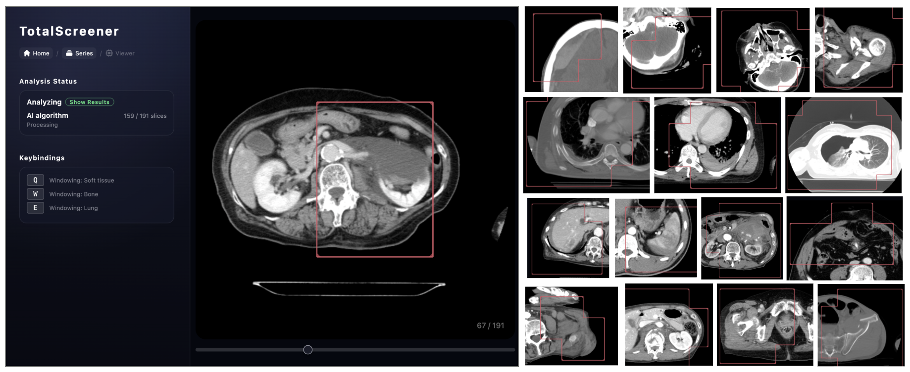

# TotalScreener: Supplementary Information

## Notice Regarding Availability of Supplementary Materials

This repository is intended to provide the **Supplementary Tables**, **Supplementary Figures**, and **Supplementary Information** associated with the following manuscript submitted to **MICCAI 2026**:

> **TotalScreener: Clinical Impact of a Trauma CT Decision Support System through Reverse-Engineering Diagnostic Process – An International Multicenter Model Development and Validation Study**

In accordance with the anonymization requirements for peer review under the **MICCAI 2026 submission policy**, **these supplementary materials will be made publicly available upon official acceptance of the manuscript**.
